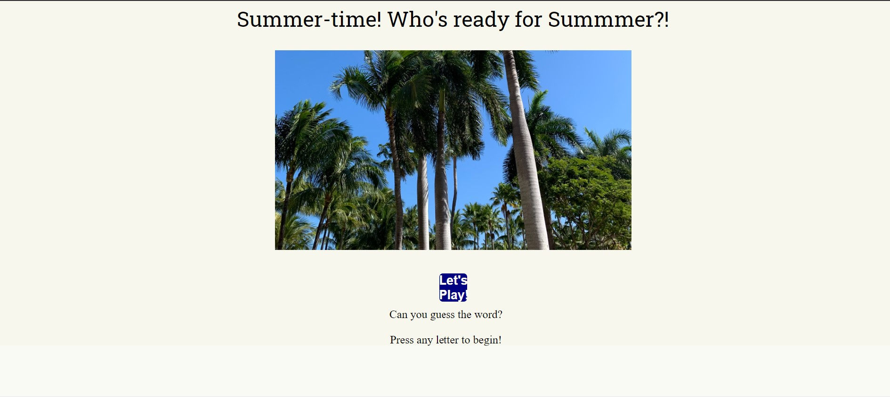

# Word-Guess-Game

## Overview
A web app game that uses HTML/CSS for design and powered by JavaScript code for the interactive features. This game will require the user to input a guessed letter by clicking on the desired alphabet. The user is provided with 10 attempts at guessing the right word. If the word isn't guessed correctly, the user loses that guess and it moves onto the next word.

## Installing
* Clone the repo as a base starter.
* You can then update the content of guesses and answers in game.js file.

## Technology Used
* HTML
* CSS
* JavaScript

## Notes 

Things I didn't fully complete - an active "Let's Play" button.
Was supposed to have it transition from intro screen to game screen.
Random category became undefined for a few of the words I had picked.
Couldn't remember how to get the scoreboard working.

[GitHub] https://github.com/JKGills12/Word-Guess-Game.git

[Word Guess Game] https://jkgills12.github.io/Word-Guess-Game/
